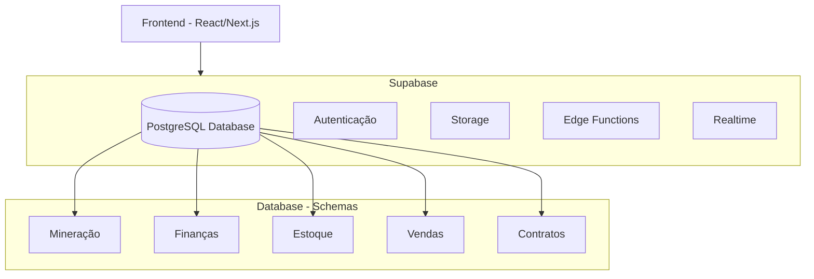

# MineHub – Arquitetura

Visão geral do sistema: frontend em React/Next.js e backend em Supabase.

## Diagrama de arquitetura

## Componentes

| Camada | Tecnologia | Descrição |
|--------|------------|-----------|
| **Frontend** | React / Next.js | Interface do usuário |
| **Backend** | Supabase | BaaS (Backend as a Service) |

### Supabase

- **PostgreSQL** – Banco de dados relacional
- **Autenticação** – Login, sessões, usuários
- **Storage** – Arquivos e mídia
- **Edge Functions** – Lógica serverless (Deno)
- **Realtime** – Subscriptions e atualizações em tempo real

### Domínios do banco (schemas/tabelas)

- **Mineração** – Dados de mineração (produção, equipamentos, etc.)
- **Finanças** – Contas, movimentações, relatórios financeiros
- **Estoque** – Materiais, insumos, almoxarifado
- **Vendas** – Pedidos, clientes, faturamento
- **Contratos** – Contratos com clientes/fornecedores

## Fluxo de dados

1. O frontend (Next.js) consome a API e o cliente do Supabase.
2. Autenticação via Supabase Auth (sessões e JWT).
3. Dados persistentes no PostgreSQL (schemas acima).
4. Arquivos em Supabase Storage quando necessário.
5. Lógica extra em Edge Functions; Realtime para atualizações ao vivo.
