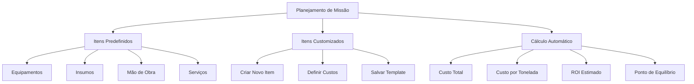

# Planejamento de Missão / Simulador

Fluxo do módulo (conforme diagrama):

## Implementado

- **Itens predefinidos:** categorias Equipamentos, Insumos, Mão de obra, Serviços (tabela `itens_predefinidos` + seed).
- **Itens customizados:** adicionar por categoria, nome, unidade, quantidade e custo unitário.
- **Cálculo automático:** custo total, custo por tonelada (se toneladas estimadas informadas), ROI estimado (se receita ou preço/ton), ponto de equilíbrio em toneladas.
- **Salvar como template:** campo "Salvar como template (nome)" ao criar o plano; o plano fica listado e pode ser reutilizado como referência (cópia manual dos itens em um novo plano).

## Próximos passos (sugestões)

- **Criar plano a partir de template:** botão "Usar template" na listagem, abrindo um novo plano já preenchido com os itens do template escolhido.
- **CRUD de itens predefinidos:** tela para a empresa adicionar/editar itens predefinidos (hoje só via SQL ou Supabase).
- **Comparar cenários:** salvar 2+ versões do mesmo plano (ex.: cenário conservador vs otimista) e exibir lado a lado.
